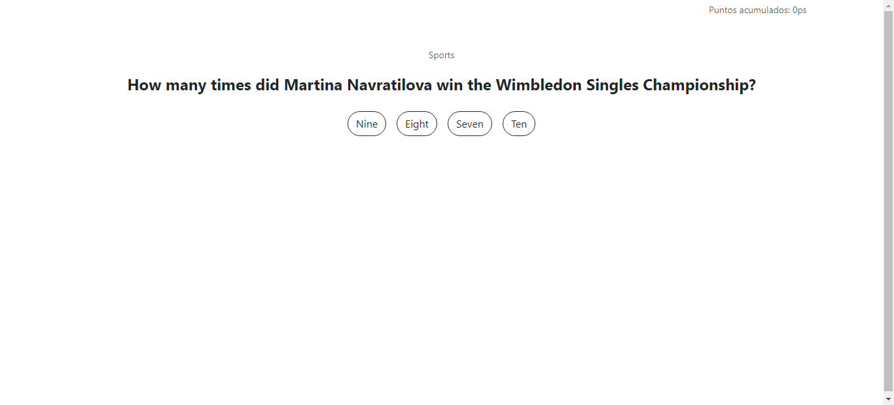

# Trivia de Videojuegos 🎮

Completa las preguntas de este maravilloso juego de trivia 😎.

### Qué contiene y cómo está desarrollada ❓

- Contiene:

  - Página principal (elige la categoría y la dificultad para poder empezar)
  - Preguntas a responder (tienes una oportunidad para responder correctamente)
  - Al finalizar podrás ver el puntaje que obtuviste.

- Está desarrollada con [Vue 2](https://v2.vuejs.org/) y [Pinia](https://pinia.vuejs.org/).

### Tecnologías utilizadas 👨‍💻

- [Vite](https://vitejs.dev/)
- [Pinia](https://pinia.vuejs.org/)
- [Typescript](https://www.typescriptlang.org/)

### Live Preview 👁‍🗨

[https://test-vue-2-livid.vercel.app/](https://test-vue-2-livid.vercel.app/)

### Clona el repositorio e instala las dependencias

- yarn o npm install
- yarn dev o npm run dev
