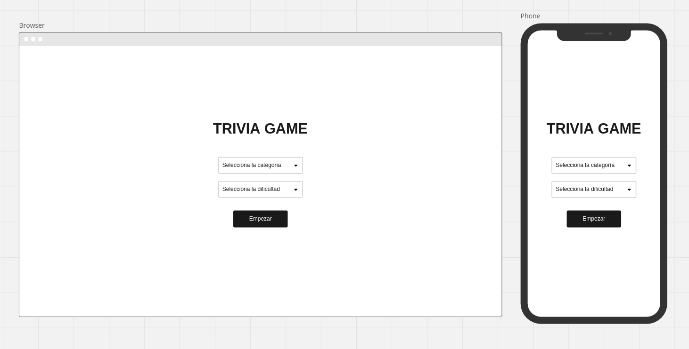
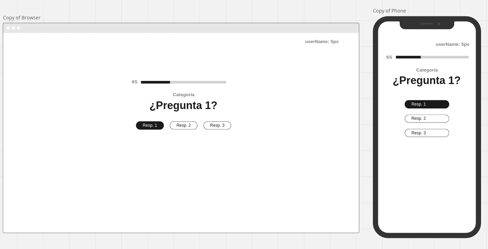
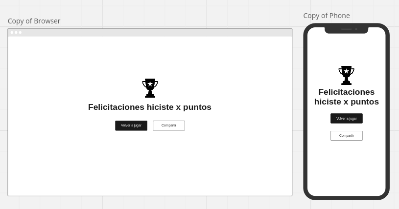

# Desafío Frontend Vue.js - Trivia de Videojuegos 🎮

¡Hola!, te damos la bienvenida a este reto para formar parte de la familia @[LUDIK](https://ludik.pe/)!

## Concepto e historias de usuario
Te proporcionaremos las funcionalidades que buscamos implementar, pero eres libre de añadir o mejorar lo que consideres necesario.

### Pantalla principal
La aplicación deberá tener las siguientes funcionalidades:

* Como usuario, quiero poder seleccionar la dificultad de la trivia (fácil, media o difícil).
* Como usuario, quiero tener la opción de seleccionar una categoría específica de preguntas sobre videojuegos de entre las disponibles en la API.
* Como usuario, quiero que se me muestre una pregunta con varias opciones de respuesta y poder seleccionar una de ellas.
* Como usuario, quiero que se haga un seguimiento de mi puntuación y se muestre en tiempo real durante la trivia.
* Como usuario, quiero ver mi puntuación total, así como la lista de preguntas acertadas y falladas al final de la trivia.
* Como usuario, quiero que se me proporcione un botón para reiniciar la trivia con una nueva selección aleatoria de preguntas.

### Wireframes de baja

### Requisitos Técnicos

* Utiliza Vue2.js y la API de @[Open Trivia Database](https://opentdb.com/)! para obtener las preguntas de la trivia.
* La interfaz de usuario debe ser atractiva y amigable para el usuario, con un diseño responsivo.
* La aplicación debe manejar errores y situaciones inesperadas de manera adecuada.
* Se valorará la calidad del código y la organización del proyecto.

### Entrega 📋

* Deberás proporcionarnos un enlace al repositorio que deberemos clonar.
* Incluye los pasos de configuración del proyecto en un README.md para que podamos ejecutar el proyecto.
* Se valorará positivamente la inclusión de una pequeña documentación explicando las decisiones de diseño y tecnologías utilizadas.

### Sugerencias 🧐

* Presta especial atención a la calidad del código, el formato y las mejores prácticas.
* Comienza a utilizar el repositorio desde el principio, no subas todo el proyecto en un solo commit.

### Puntos extra 🌟

* La aplicación está implementada y activa
* Se evaluará el tiempo de envío de la prueba VS el tiempo en que nos envías tu entregable 🕒

### Millas extra 🥇

* Optimizaciones de rendimiento
* Características sorprendentes que no esperamos obtener 😉

___

**¡Éxitos y cualquier duda, siéntete libre de escribirnos! 💫**

* Claudia Urcia Castillo (Jefe de desarrollo)  - clau@ludik.pe
